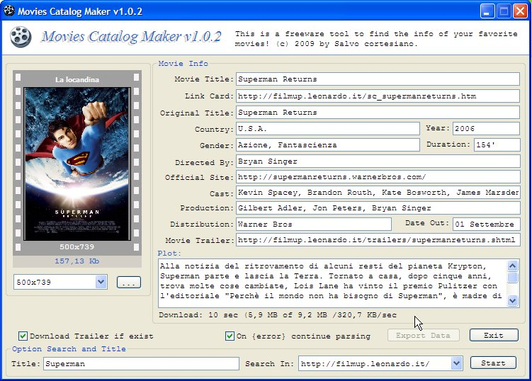



## Movie Catalog Maker

### Description

Example of how to find info about a movie, view the cover (download), and possibly download the trailer! Remember to check in libraries project the (Microsoft Scripting Runtime) and (Microsoft HTM Object Library)!

NOTE: When you run the script, you'll see a standard dialog box of IE, will tell you that the page contains a script and if you want to run it, dono't worry you go!

Enjoy :)
 
### More Info
 

             |
---                |---
**Submitted On**   |2009-09-04 00:55:54
**By**             |[Salvo Cortesiano \(Italy\)](https://github.com/Planet-Source-Code/PSCIndex/blob/master/ByAuthor/salvo-cortesiano-italy.md)
**Level**          |Advanced
**User Rating**    |5.0 (10 globes from 2 users)
**Compatibility**  |VB 6\.0
**Category**       |[Internet/ HTML](https://github.com/Planet-Source-Code/PSCIndex/blob/master/ByCategory/internet-html__1-34.md)
**World**          |[Visual Basic](https://github.com/Planet-Source-Code/PSCIndex/blob/master/ByWorld/visual-basic.md)
**Archive File**   |[Movie\_Cata216184952009\.zip](https://github.com/Planet-Source-Code/salvo-cortesiano-italy-movie-catalog-maker__1-72433/archive/master.zip)

